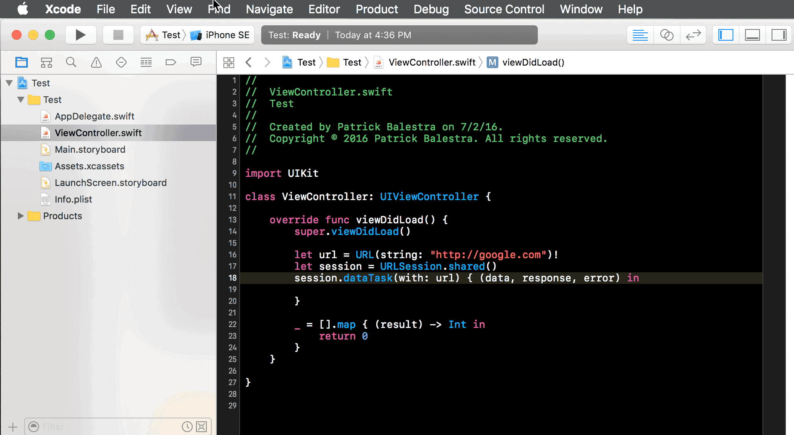

## Clean Closure - Xcode Source Editor Extension

Clean Closure is a simple Xcode Source Editor Extension for Xcode 8. It parses each line of a file to simplify the syntax of closures in your Swift code by removing the useless `()`.

The code is pretty straighforward and it uses a `RegularExpression` to find out where a closure is by looking for `(`,  `)` and  `in` characters.

## Requirements
Xcode 8.0 🛠

Please run `sudo /usr/libexec/xpccachectl` and restart your Mac before running the extension if you are on macOS 10.11 El Capitan.

## Author

I'm [Patrick Balestra](http://www.patrickbalestra.com).
Email: [me@patrickbalestra.com](mailto:me@patrickbalestra.com)
Twitter: [@BalestraPatrick](http://twitter.com/BalestraPatrick).

## License

`CleanClosureXcode` is available under the MIT license. See the [LICENSE](LICENSE) file for more info.
